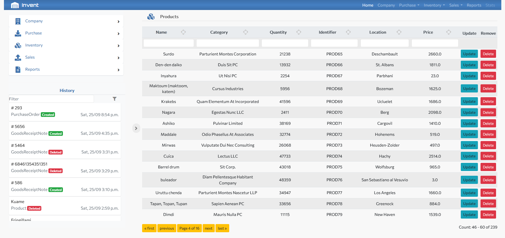

.. INVENT documentation master file, created by
   sphinx-quickstart on Tue Sep 28 21:46:50 2021.
   You can adapt this file completely to your liking, but it should at least
   contain the root `toctree` directive.

Welcome to INVENT's documentation!
==================================

**INVENT** is a inventory management software. It is a minimalistic demo application based on `Django` web framework. It was created to demostrate the rapid prototyping capabililties of `Django` for web application development.

.. toctree::
   :maxdepth: 8
   :caption: Contents:

   about.rst
   tutorials.rst

Indices and tables
==================

* :ref:`genindex`
* :ref:`modindex`
* :ref:`search`
